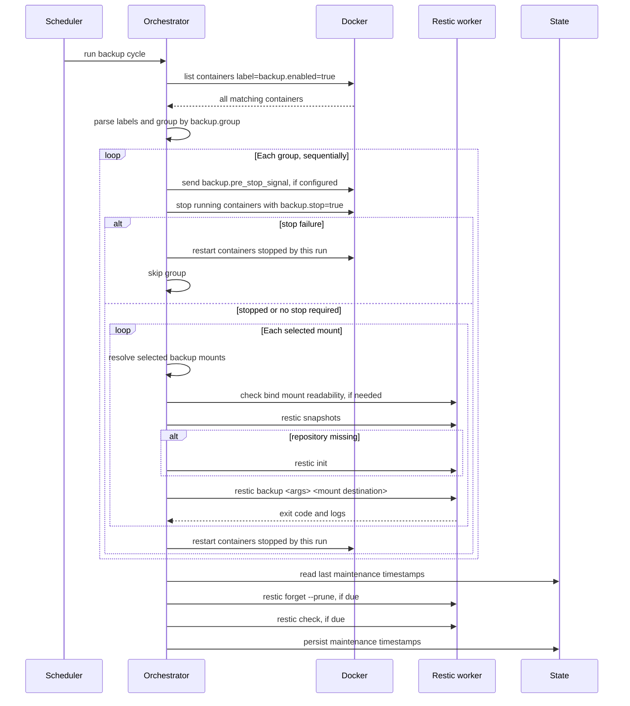

# Opigen Backup


Docker volume backup orchestrator for restic. The service discovers Docker
containers that opt in with labels, groups them for coordinated stop/start,
backs up selected named volumes through ephemeral restic worker containers, and
runs repository maintenance after the backup pass completes.

## Features

- Backs up named Docker volumes and readable bind mounts.
- Discovers all containers with `backup.enabled=true`, including stopped
  containers.
- Groups containers by `backup.group` so related services can be stopped
  together for consistency.
- Stops only containers with `backup.stop=true`, and restarts only containers
  stopped by the current run.
- Defaults to named volumes when `backup.mounts` is omitted, with optional
  selection by Docker volume name or container mount destination.
- Treats `backup.mounts=all` as all readable backup-capable mounts.
- Parses global and per-container restic arguments with `shlex.split`.
- Supports a narrow pre-stop Docker signal before the normal stop/backup/start
  flow.
- Auto-initializes the restic repository when `restic snapshots` shows it is
  missing.
- Runs `forget --prune` and `check` once after all backup groups finish.
- Supports one-shot CLI mode and scheduled service mode.
- Emits structured JSON logs to stdout.

## Quick Start

Pull the published image from GitHub Container Registry:

```bash
docker pull ghcr.io/jakob1379/opigen:latest
```

Pin a release by using its semver tag instead of `latest`, for example
`ghcr.io/jakob1379/opigen:0.1.0`.

Release images are built with Nix from `.#dockerImage` and published when a
semver Git tag is pushed. The production image contains the backup app, restic,
and CA certificates only. The Docker integration test uses a separate
`.#testFixtureImage` for shell-based test containers, so shell/coreutils do not
ship in the runtime image.

Run one backup pass:

```bash
docker run --rm \
  --read-only \
  --cap-drop ALL \
  --security-opt no-new-privileges:true \
  --group-add "$(stat -c '%g' /var/run/docker.sock)" \
  --tmpfs /tmp:rw,nosuid,nodev,size=64m \
  -v /var/run/docker.sock:/var/run/docker.sock \
  -v ./config:/config:ro \
  -v opigen-backup-state:/state \
  ghcr.io/jakob1379/opigen:latest run-once --config /config/backup.toml
```

Preview the same pass without stopping containers, writing state, or running
restic:

```bash
docker run --rm \
  --read-only \
  --cap-drop ALL \
  --security-opt no-new-privileges:true \
  --group-add "$(stat -c '%g' /var/run/docker.sock)" \
  --tmpfs /tmp:rw,nosuid,nodev,size=64m \
  -v /var/run/docker.sock:/var/run/docker.sock \
  -v ./config:/config:ro \
  ghcr.io/jakob1379/opigen:latest run-once --dry-run --config /config/backup.toml
```

Run as a scheduled service:

```bash
docker run -d \
  --name opigen-backup \
  --restart unless-stopped \
  --read-only \
  --cap-drop ALL \
  --security-opt no-new-privileges:true \
  --group-add "$(stat -c '%g' /var/run/docker.sock)" \
  --tmpfs /tmp:rw,nosuid,nodev,size=64m \
  -v /var/run/docker.sock:/var/run/docker.sock \
  -v ./config:/config:ro \
  -v opigen-backup-state:/state \
  -e CONFIG_PATH=/config/backup.toml \
  ghcr.io/jakob1379/opigen:latest
```

The container default command is `serve`.

The image runs the long-lived controller process as UID/GID `65532:65532`.
Because the controller needs Docker API access, add the host Docker socket group
when the socket is group-readable. The ephemeral restic worker containers are
started as root so they can read arbitrary source volume ownership, but they run
with `no-new-privileges`, a read-only root filesystem, and a `/tmp` tmpfs.

## Configuration

Example config:

```toml
[backup]
repository = "s3:http://rustfs:9000/backups"
password_file = "/run/secrets/restic_password"
aws_access_key_id_file = "/run/secrets/aws_access_key"
aws_secret_access_key_file = "/run/secrets/aws_secret_key"

[runtime]
worker_image = "ghcr.io/jakob1379/opigen:latest"
# Optional bind mounts for worker containers, useful for local restic repositories.
worker_mounts = []

[state]
path = "/state/backup_state.json"

[health]
bind_host = "127.0.0.1"
port = 8080
# Optional. Default is twice the configured schedule interval.
readiness_max_age_seconds = 172800

[logging]
level = "info"
format = "json" # json or console

[discovery]
default_mounts = "named" # named or all when backup.mounts is omitted
unreadable_mount = "skip"

[schedule]
enabled = true
frequency = "daily"
preferred_time = "02:00:00"

[prune]
enabled = true
keep_hourly = 48
keep_daily = 14
keep_weekly = 4
keep_monthly = 12
keep_yearly = 10

[check]
enabled = true
frequency = "weekly"

[restic]
global_args = "--verbose"

[timeouts]
stop_grace_period = 30
backup_operation = 3600
```

`[state].path` should live on persistent storage if prune/check timing should
survive service restarts. The same state file stores backup metadata used by
restore commands and by the health/metrics endpoints.

## Container Labels

| Label                          | Required | Default | Description                                                  |
| ------------------------------ | -------- | ------- | ------------------------------------------------------------ |
| `backup.enabled`               | Yes      | -       | Set to `true` to opt in.                                     |
| `backup.group`                 | Yes      | -       | Group key for coordinated sequential backup.                 |
| `backup.stop`                  | No       | `true`  | Stop the container during its group backup.                  |
| `backup.restic_args`           | No       | empty   | Extra restic backup args, parsed shell-style.                |
| `backup.mounts`                | No       | config  | `all` or CSV of volume names / container mount destinations. |
| `backup.pre_stop_signal`       | No       | empty   | Docker signal sent before the normal stop action.            |
| `backup.pre_stop_wait_seconds` | No       | `0`     | Delay after the pre-stop signal before stopping.             |

Example labels:

```yaml
services:
  postgres:
    labels:
      - backup.enabled=true
      - backup.group=postgres
      - backup.restic_args=--exclude=pg_wal --one-file-system
      - backup.mounts=pgdata,/var/lib/postgresql/data
      - backup.pre_stop_signal=USR1
      - backup.pre_stop_wait_seconds=10

  prometheus:
    labels:
      - backup.enabled=true
      - backup.group=monitoring
      - backup.stop=false
```

Unsupported mount types such as `tmpfs`, Swarm configs/secrets, named pipes, and
unknown Docker mount types are skipped with an explicit log reason. Readable
bind mounts are mounted read-only into the restic worker and skipped with a
warning if the worker cannot read them.

## Restore

Backups record the group, source container, selected mount, original mount
destination, image reference, image ID, repo digest when available, restic
snapshot ID, and backup outcome.

```bash
backup restore list --config /config/backup.toml
backup restore plan <backup-id> --config /config/backup.toml
backup restore volume <backup-id> --config /config/backup.toml
```

`restore volume` creates a new Docker volume by default and restores the saved
mount path into it. It refuses to restore when the current image ID or repo
digest for the original image reference does not match the backup metadata. Use
`--allow-image-drift` only after intentionally accepting that mismatch.

## Health And Metrics

`serve` starts a small HTTP server alongside the scheduler. It binds to
`127.0.0.1:8080` by default.

- `GET /healthz` returns healthy when config and state can be loaded.
- `GET /readyz` fails after a failed backup run or when the last successful
  backup is older than the configured readiness age.
- `GET /metrics` exposes Prometheus text metrics for backup runs, volumes,
  containers, restic maintenance, durations, last success, last run, next run,
  and build info.

## Docker Compose

The service needs a writable Docker socket because it stops, starts, and creates
containers through the Docker API.

```yaml
services:
  backup:
    profiles: [infra]
    image: ghcr.io/jakob1379/opigen:latest
    read_only: true
    cap_drop:
      - ALL
    security_opt:
      - no-new-privileges:true
    group_add:
      # Set DOCKER_SOCKET_GID with:
      # export DOCKER_SOCKET_GID="$(stat -c '%g' /var/run/docker.sock)"
      - "${DOCKER_SOCKET_GID}"
    tmpfs:
      - /tmp:rw,nosuid,nodev,size=64m
    volumes:
      - /var/run/docker.sock:/var/run/docker.sock
      - ./config:/config:ro
      - backup-state:/state
    environment:
      - CONFIG_PATH=/config/backup.toml
    secrets:
      - restic_password
      - aws_access_key
      - aws_secret_key
    restart: unless-stopped

volumes:
  backup-state:
```

## Backup Flow



## Development

Enter the dev shell:

```bash
nix develop
```

Build the service image locally:

```bash
nix build .#dockerImage
docker load < result
```

Build the Python application:

```bash
nix build .#opigen-backup
```

Run tests:

```bash
nix flake check
```

Run the Docker integration test:

```bash
nix develop -c env OPIGEN_RUN_DOCKER_INTEGRATION=1 pytest -q -m integration
```

The integration test creates a labeled Docker container with a named volume,
runs `nix run .#backup` against it, stores a local restic repository through a
worker bind mount, and validates the snapshot with `restic dump` in Docker.

Run the CLI locally from the Nix-built app:

```bash
nix run .#backup -- run-once --config config/backup.toml
```
