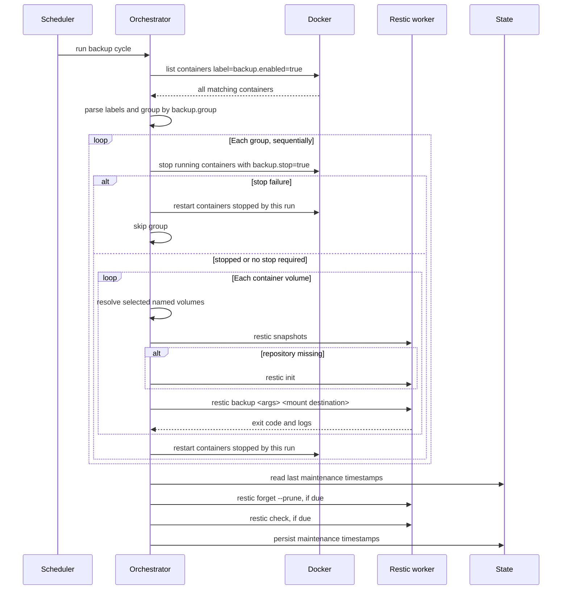

# Opigen Backup

Docker volume backup orchestrator for restic. The service discovers Docker
containers that opt in with labels, groups them for coordinated stop/start,
backs up selected named volumes through ephemeral restic worker containers, and
runs repository maintenance after the backup pass completes.

## Features

- Backs up named Docker volumes only.
- Discovers all containers with `backup.enabled=true`, including stopped
  containers.
- Groups containers by `backup.group` so related services can be stopped
  together for consistency.
- Stops only containers with `backup.stop=true`, and restarts only containers
  stopped by the current run.
- Defaults to all named volumes, with optional CSV selection by Docker volume
  name or container mount destination.
- Parses global and per-container restic arguments with `shlex.split`.
- Auto-initializes the restic repository when `restic snapshots` shows it is
  missing.
- Runs `forget --prune` and `check` once after all backup groups finish.
- Supports one-shot CLI mode and scheduled service mode.
- Emits structured JSON logs to stdout.

## Quick Start

Build the service image:

```bash
nix build .#dockerImage
docker load < result
```

The production image contains the backup app, restic, and CA certificates only.
The Docker integration test uses a separate `.#testFixtureImage` for shell-based
test containers, so shell/coreutils do not ship in the runtime image.

Build the Python application:

```bash
nix build .#opigen-backup
```

Run one backup pass:

```bash
docker run --rm \
  -v /var/run/docker.sock:/var/run/docker.sock \
  -v ./config:/config:ro \
  -v opigen-backup-state:/state \
  opigen-backup:latest run-once --config /config/backup.toml
```

Run as a scheduled service:

```bash
docker run -d \
  --name opigen-backup \
  --restart unless-stopped \
  -v /var/run/docker.sock:/var/run/docker.sock \
  -v ./config:/config:ro \
  -v opigen-backup-state:/state \
  -e CONFIG_PATH=/config/backup.toml \
  opigen-backup:latest
```

The container default command is `serve`.

## Configuration

Example config:

```toml
[backup]
repository = "s3:http://rustfs:9000/backups"
password_file = "/run/secrets/restic_password"
aws_access_key_id_file = "/run/secrets/aws_access_key"
aws_secret_access_key_file = "/run/secrets/aws_secret_key"

[runtime]
worker_image = "opigen-backup:latest"
# Optional bind mounts for worker containers, useful for local restic repositories.
worker_mounts = []

[state]
path = "/state/backup_state.json"

[schedule]
enabled = true
frequency = "daily"
preferred_time = "02:00:00"

[prune]
enabled = true
keep_hourly = 48
keep_daily = 14
keep_weekly = 4
keep_monthly = 12
keep_yearly = 10

[check]
enabled = true
frequency = "weekly"

[restic]
global_args = "--verbose"

[timeouts]
stop_grace_period = 30
backup_operation = 3600
```

`[state].path` should live on persistent storage if prune/check timing should
survive service restarts.

## Container Labels

| Label | Required | Default | Description |
| --- | --- | --- | --- |
| `backup.enabled` | Yes | - | Set to `true` to opt in. |
| `backup.group` | Yes | - | Group key for coordinated sequential backup. |
| `backup.stop` | No | `true` | Stop the container during its group backup. |
| `backup.args` | No | empty | Extra restic backup args, parsed shell-style. |
| `backup.volumes` | No | `all` | `all` or CSV of named volume names / mount destinations. |

Example labels:

```yaml
services:
  postgres:
    labels:
      - backup.enabled=true
      - backup.group=postgres
      - backup.args=--exclude=pg_wal --one-file-system
      - backup.volumes=pgdata,/var/lib/postgresql/data

  prometheus:
    labels:
      - backup.enabled=true
      - backup.group=monitoring
      - backup.stop=false
```

Bind mounts are ignored in v1, even when selected manually.

## Docker Compose

The service needs a writable Docker socket because it stops, starts, and creates
containers through the Docker API.

```yaml
services:
  backup:
    profiles: [infra]
    image: opigen-backup:latest
    volumes:
      - /var/run/docker.sock:/var/run/docker.sock
      - ./config:/config:ro
      - backup-state:/state
    environment:
      - CONFIG_PATH=/config/backup.toml
    secrets:
      - restic_password
      - aws_access_key
      - aws_secret_key
    restart: unless-stopped

volumes:
  backup-state:
```

## Backup Flow



## Development

Enter the dev shell:

```bash
nix develop
```

Run tests:

```bash
nix flake check
```

Run the Docker integration test:

```bash
nix develop -c env OPIGEN_RUN_DOCKER_INTEGRATION=1 pytest -q -m integration
```

The integration test creates a labeled Docker container with a named volume,
runs `nix run .#backup` against it, stores a local restic repository through a
worker bind mount, and validates the snapshot with `restic dump` in Docker.

Run the CLI locally from the Nix-built app:

```bash
nix run .#backup -- run-once --config config/backup.toml
```
